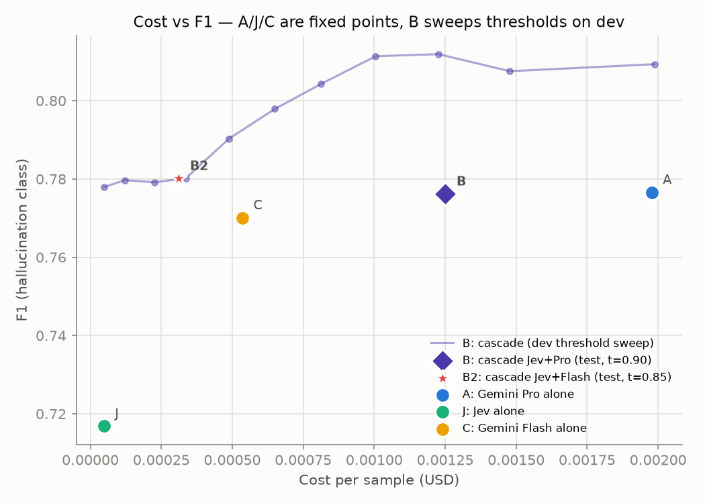
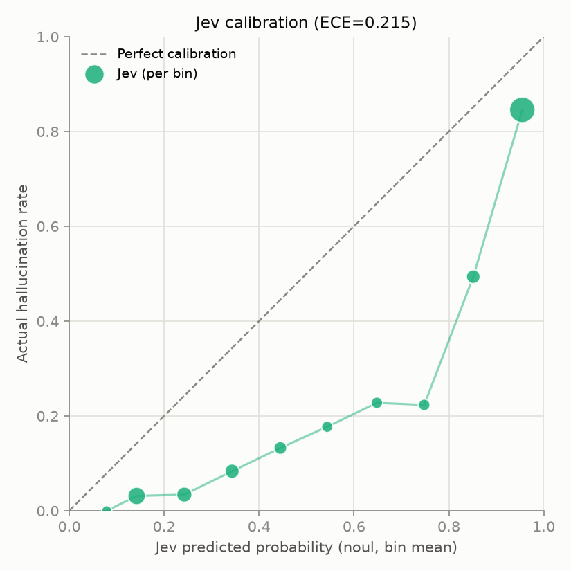
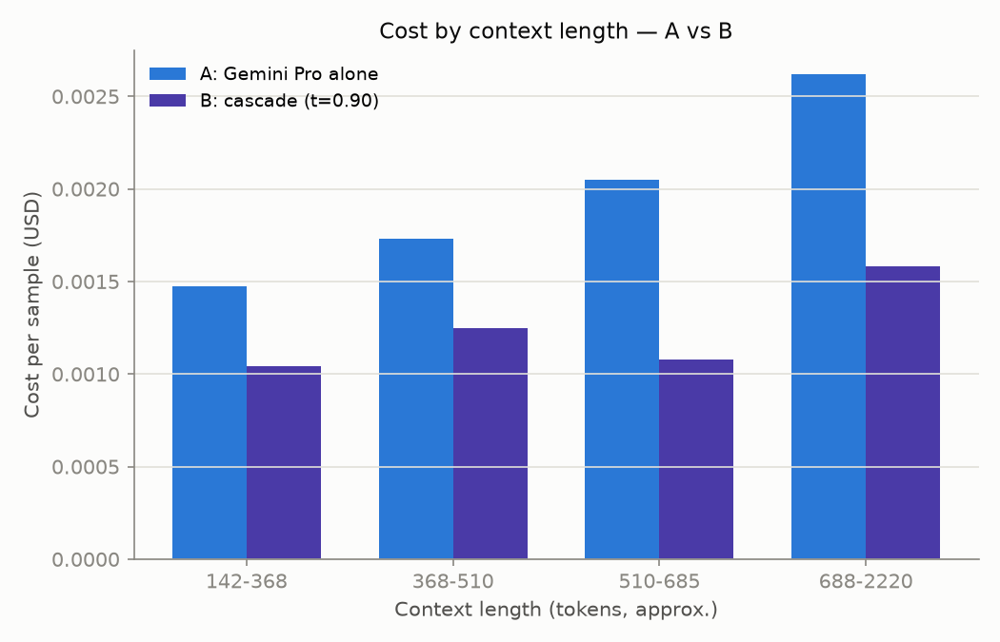

# jev-rag-cost-benchmark

RAG 답변이 **근거 문서에 없는 내용을 지어내거나 모순되는 말을 하는 것**(환각)을
판정할 때, 매번 비싼 AI 모델에게 묻는 대신 **저렴한 모델(Jev)에게 먼저 묻고 애매할
때만 다른 모델에게 다시 묻는 방식**으로 비용을 줄일 수 있는지 직접
실험해본 프로젝트입니다.

## 한 줄 결론

**Jev로 먼저 거르고 애매한 것만 저렴한 모델(Flash)에게 넘기면, 비싼 모델(Pro)을
한 번도 쓰지 않고도 비싼 모델만 썼을 때와 같은 수준의 성능을 84% 적은 비용으로
얻을 수 있었습니다.** (참고로 Jev의 폴백 대상을 저렴한 모델 대신 비싼 모델로
바꿔봤더니 오히려 이득이 없었습니다 — Jev는 "비싼 모델로 가는 관문"이 아니라
"애매한 것만 저렴한 모델에게 넘기는 필터"로 쓸 때 가장 잘 작동했습니다.)

## 용어 한 번만 설명

- **F1**: 환각을 놓치지 않으면서 헛짚지도 않는 정도를 합친 점수 (1에 가까울수록 좋음)
- **[0.74, 0.81] 같은 범위**: 오차범위. 두 모델의 범위가 겹치면 "사실상 비슷한 점수"
- **coverage**: Jev 혼자 답을 끝낸 비율 (나머지는 다른 모델에게 다시 물어봄)

## 무엇을 비교했나

|          | 방식                      | 비고                               |
| -------- | ------------------------- | ---------------------------------- |
| A (기준) | 비싼 모델(Gemini Pro)만   | 원래 하던 방식                     |
| J        | Jev만                     | Jev 단독 정확도 확인용             |
| C        | 중간 모델(Gemini Flash)만 | "그냥 싼 모델 쓰면 안 되나" 대조군 |
| B        | Jev → 애매하면 **Pro**    | 싼 모델 + 비쌀 때만 큰 모델        |
| B2       | Jev → 애매하면 **Flash**  | B와 동일 구조, 폴백만 교체         |

C가 중요한 이유: Jev 없이 싼 모델 하나만 써도 충분하다면 굳이 복잡한 구조를 쓸
이유가 없기 때문입니다. "비교 없이 좋아 보이는 결과"를 걸러내는 장치입니다.

## 데이터 & 방식

[RAGTruth](https://github.com/ParticleMedia/RAGTruth) — 사람이 단어 단위로 환각을
표시해둔 공개 데이터셋. 질문답변/표데이터설명/요약 세 작업, 전체 응답의 40.8%가 환각.
**1,000건은 다시 물을지 말지 기준(임계값)을 정하는 용도로, 다른 1,000건은 그 기준을
고정해 딱 한 번 최종 채점하는 용도로** 나눠 썼습니다 (처음 500+500으로 시작해 신뢰도를
높이려 두 배로 늘렸습니다).

Jev와 Gemini 둘 다에게 "근거 문서"와 "모델 답변"만 주고 똑같이 물었습니다 — _"이
답변에 근거 문서가 뒷받침하지 않거나 모순되는 내용이 있나요?"_ Jev는 0~1 확률로,
Gemini는 예/아니오로 답하게 했고, "생각 과정"(thinking) 비용도 전부 포함했습니다.

**핵심 설계**: 세 모델 모두에게 딱 한 번씩만 묻고 답을 전부 저장해뒀습니다. 임계값을
0.5로 할지 0.9로 할지, 폴백 상대를 Pro로 할지 Flash로 할지도 저장된 답으로 계산만
다시 해서 추가 비용 없이 테스트했습니다 — B2도 이 덕분에 추가 호출 없이 바로
계산해낸 결과입니다.

## 재현 방법

```bash
python3 -m venv .venv && .venv/bin/pip install -e ".[dev]"
cp .env.example .env && gcloud auth application-default login

.venv/bin/jev-rag-bench prepare-data   # 데이터 준비
.venv/bin/jev-rag-bench pilot          # 소량 테스트 (30건)
.venv/bin/jev-rag-bench run            # 본 실행
.venv/bin/jev-rag-bench sweep          # 결과/그래프 생성
```

설정·가격은 `configs/`에, 테스트는 `.venv/bin/pytest tests/` (29개, 전부 통과). 비용이
크지 않아(총 $5.1) 전부 로컬에서 돌렸고, 더 큰 규모로 돌리려면 `docs/gcp_setup.md`에
필요한 클라우드 명령어를 정리해뒀습니다.

## 결과

실제로 쓴 돈 **$5.1**, API 호출 8,000여 건 중 오류 0건.



왼쪽 위에 있을수록 좋은 결과(싸고 정확함)입니다. 별표(B2)가 가장 왼쪽 위에 있습니다.

| 방식              | 정확도    | F1                       | 비용/건      | 속도  |
| ----------------- | --------- | ------------------------ | ------------ | ----- |
| A: 비싼 모델만    | 0.828     | 0.777 [0.744, 0.808]     | $0.00198     | 2.4초 |
| J: Jev만          | 0.752     | 0.717 [0.684, 0.750]     | $0.00005     | 0.2초 |
| C: 중간 모델만    | **0.840** | 0.770 [0.735, 0.805]     | $0.00054     | 1.2초 |
| B: Jev→Pro        | 0.827     | 0.776 [0.743, 0.807]     | $0.00125     | 1.7초 |
| **B2: Jev→Flash** | 0.836     | **0.780** [0.747, 0.811] | **$0.00031** | 0.8초 |

**핵심은 B2입니다** — 비싼 모델(A)과 F1이 통계적으로 같은 수준(오차범위가 겹침)이면서
비용은 84% 적습니다. (참고로 폴백 대상을 Flash 대신 Pro로 한 B는, A보다 37% 싸긴
했지만 그냥 중간 모델 하나만 쓰는 C보다도 못했습니다 — 그래서 "폴백을 저렴한 모델로"가
중요했습니다.) 다만 "단순 정확도"만 보면 이번엔 C가 가장 높게 나와서, 정확도 하나만으로
판단하면 안 되고 F1도 같이 봐야 한다는 걸 보여줍니다.

**실제 규모로 환산하면**: 하루 10만 건 처리 기준 A $198, B2 $31 — 하루 167달러,
한 달 약 5,000달러 차이입니다. 점수가 사실상 같다면 더 싼 쪽을 안 쓸 이유가 없습니다.

| 작업                 | A     | J     | C     | B     | B2        |
| -------------------- | ----- | ----- | ----- | ----- | --------- |
| 표데이터설명 (n=350) | 0.846 | 0.784 | 0.825 | 0.845 | 0.827     |
| 질문답변 (n=313)     | 0.627 | 0.590 | 0.676 | 0.627 | **0.704** |
| 요약 (n=337)         | 0.750 | 0.680 | 0.716 | 0.750 | **0.727** |

(F1 기준) 500건일 땐 "표데이터설명에서 캐스케이드가 제일 잘 통한다"였는데 1,000건으로
늘리니 오히려 질문답변에서 B2가 가장 낫게 나왔습니다 — 작업별 숫자는 아직 표본이 늘면
바뀔 수 있다는 뜻입니다.



Jev의 확신도 곡선(초록)이 "확신도=실제 정답률"인 점선보다 아래에 있습니다 — 중간
정도 확신할 때 실제보다 과하게 "환각"이라고 말하는 경향(ECE 0.215)이 있습니다. 그래도
전략이 통한 이유는 확률을 곧이곧대로 믿지 않고, dev 데이터로 "이 기준이 실제로
좋더라"를 직접 확인하고 임계값을 정했기 때문입니다.



근거 문서가 길수록 비싼 모델(A) 비용은 거의 비례해 늘지만 캐스케이드(B)는 덜
늘어납니다 — 문서가 길수록 캐스케이드 이득이 커집니다.

Jev 가격이 워낙 저렴해서($0.042 vs $1.25~10, 100만 토큰당) 임계값을 어떻게 잡든
거의 항상 "Jev 쓰는 게 손해는 아닌" 구간이었습니다. 유일한 예외는 "거의 모든 경우를
다시 묻는" 극단적인 기준뿐이었는데, 이건 Jev를 거의 안 쓰는 셈이라 당연합니다.

## 한계점 — 솔직하게

- **영어 데이터만.** 다른 언어는 결과가 다를 수 있습니다.
- **표본이 아직 크지 않습니다.** 작업별로 300여 건뿐이고, 실제로 500→1,000건으로
  늘렸더니 작업별 순위가 바뀌는 걸 확인했습니다 — 더 늘리면 또 바뀔 수 있습니다.
- **Jev의 확신도를 그대로 믿기는 어렵습니다** (캘리브레이션 참고). 질문 문구를 있는
  그대로 해석하는 경향도 있어, 문구를 바꾸면 결과가 달라질 수 있습니다.

## 출처

[RAGTruth](https://github.com/ParticleMedia/RAGTruth) (Wu et al., 2023)
